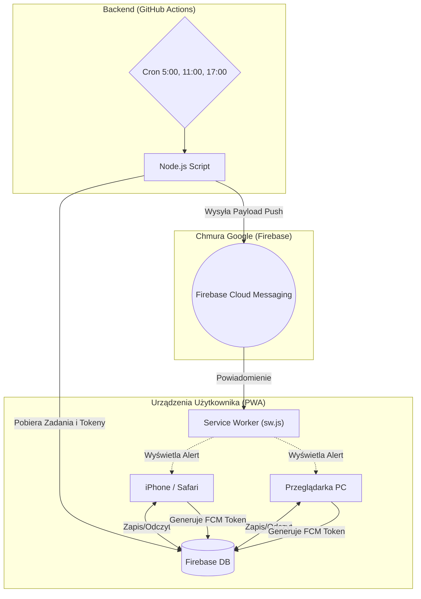

# B-Core 🧠 (Osobisty System Produktywności)

  
  
  
  
  
  
  
  
  

Witaj w centralnym repozytorium **B-Core** – mojego własnego, mocno przebudowanego systemu produktywności. Całość postawiłem na darmowej architekturze Serverless. Aplikacja hula jako PWA (Progressive Web App) prosto z GitHub Pages. Podeszłem do tematu tak, żeby nie płacić za hosting, więc dane lecą przez Firebase, a zadania i powiadomienia odpalam darmowym "backendem" zrobionym na GitHub Actions.

### W czym to napisałem? (Stos Technologiczny)
* **HTML5 / CSS3 / JavaScript (Vanilla):** Cały front-end aplikacji naklepałem z palca. Zdecydowałem się na czysty kod (olałem frameworki typu React czy Vue), bo chciałem zobaczyć, jak szybko to może śmigać na słabszych telefonach. Szczerze? Ładuje się w ułamek sekundy.
* **Firebase (Realtime DB, Auth, Cloud Messaging):** Szybka baza NoSQL, która magazynuje moje całe cyfrowe życie. Oprócz logowania, ogarnia też wypluwanie powiadomień Push (FCM). Chociaż 14 kwietnia spędziłem bite 6 godzin szukając dlaczego tokeny na iOS nagle wyparowały...
* **GitHub Actions & Node.js:** Node'owe skrypty budzą się na maszynach GitHuba przez crona, skanują co mam do zrobienia w bazie i szturchają mój telefon powiadomieniem.
* **Python:** Lokalny rębajło. Skrypt `sync.bat` wywołuje kod w Pythonie, który brutalnie rozpruwa gigantyczne pliki XLSX, odcedza z nich śmieci i pakuje czysty JSON prosto do `local_data.js`.
* **Markdown:** Renderowanie notatek i list zadań.
* **Google Analytics:** Wpięte do głównych widoków, żebym wiedział, ile godzin marnuję gapiąc się w pulpit zamiast po prostu odhaczyć zadanie.

## 👀 Rzut oka na interfejs

**Wersja Desktopowa (PC)**

  

  
  

**Wersja Mobilna (PWA / Smartfon)**

  
  &nbsp;&nbsp;&nbsp;
  

Osobiście wciąż mam ochotę wywalić ten ciemny pasek boczny z wersji desktopowej, bo trochę gryzie mi się z resztą "glassmorphismu". Ale na razie nie mam wizji czym to zastąpić, więc... zostaje.

## 🏗️ Architektura Systemu

1. **Frontend (PWA):** Zwykły Vanilla JS. Żadnej magii. Dzięki Service Workerowi śmiga offline, a na telefonie zachowuje się jak natywna apka. (Choć przyznaję, agresywne cache'owanie czasami psuje mi krew po deployu).
2. **Baza Danych (Firebase Realtime Database):** Centralne przechowywanie danych.
3. **Backend / Cron (GitHub Actions):** Odpalane parę razy dziennie skrypty Node.js pobierające dane z bazy.

### Schemat Przepływu Danych

---

## 🚀 Instalacja i Konfiguracja (Self-Hosted)
Zlepiłem to wyłącznie dla siebie (reguły bezpieczeństwa Firebase z automatu blokują obcych). Ale jak koniecznie chcesz to postawić u siebie:
1. Sklonuj repozytorium.
2. Utwórz nowy projekt w [Firebase](https://firebase.google.com/) i włącz Realtime Database + Authentication (Email/Password).
3. Wyciągnij klucze konfiguracyjne ze swojej bazy i podmień je w pliku `/app/js/firebase.js`.
4. Wygeneruj klucze VAPID i wrzuć je do `notifications.js`.
5. Dodaj sekrety z Firebase w ustawieniach repo na GitHubie, żeby Actions mogły się autoryzować.

---

## 📁 Struktura Katalogów i Plików

Główna część aplikacji znajduje się w folderze `/app`. Z root-a masz tylko redirect z `index.html`.

### 📂 /.github
Katalog dla skryptów automatyzacji i Github Actions.
* `workflows/notify.yml`
* `scripts/check-and-notify.js`

### 📂 /.private
Lokalne brudy, których nie wypycham do GitHuba ze względów oczywistych.
* `sync.bat` – Zmora moich wieczorów. Ten windowsowy skrypt notorycznie sypie się przy najmniejszej zmianie ścieżek na moim dysku. Nadal nie napisałem do tego solidnego path-resolvera, więc jak coś zmieniam w systemie, muszę edytować ten plik z palca. 

### 📂 /app
Tutaj leży kod frontendu.
* `manifest.json` – Plik konfiguracyjny dla PWA.
* `sw.js` – Service Worker obsługujący logikę Push.
* **Widoki HTML:**
  * `login.html`
  * `index.html` – Złożony pulpit główny naszpikowany widgetami.
  * `inbox.html`
  * `budget.html`
  * `knowledge.html`

### 📂 /app/css
* `styles.css` – Jeden plik ze stylami CSS, zawierający też zmienne pod Dark Mode i główny układ interfejsu.

### 📂 /app/js (Logika Aplikacji)
Żeby to w ogóle dało się utrzymać, pociąłem kod na moduły ES6. 

#### ⚙️ Konfiguracja i Narzędzia
* `firebase.js` – Punkt wejścia do bazy. Sprawdza też, czy logujesz się uprawnionym mailem.
* `global.js` – Inicjalizacja statystyk w nagłówkach.
* `local_data.js` – Statyczny obiekt wygenerowany automatycznie przez plik batch.
* `utils.js` – Duperelki typu formatowanie dat i escapeHTML.
* `data.js`

#### 🔔 Powiadomienia i Ustawienia
* `notifications.js`
* `settings.js`

#### 🖥️ Pulpit Główny (`index.html`)
* `main.js`
* `dashboard.js`
* `calendar.js` – Najbardziej znienawidzony kawałek kodu w tym projekcie. Ręcznie rysuje oś czasu 7 dni w tygodniu i mapuje bloki z zadaniami z Firebase'a na precyzyjne kratki z pikselami. Myślałem, że osiwieję przy przeliczaniu stref czasowych...
* `charts.js`
* `routines.js`
* `timers.js`

#### 📥 Zrzutnia (`inbox.html`)
* `inbox.js`
* `tasks.js` – Klasyczny CRUD.
* `ideas.js`

#### 💰 Finanse (`budget.html`)
* `budget.js` – Oblicza proste sumy dla kategorii wydatków.

#### 🧠 Baza Wiedzy (`knowledge.html`)
* `knowledge.js` – Wizualizacja drzewa skilli.
* `knowledge-modal.js`
* `srs.js` – Moduł odpowiedzialny za cykliczne powtórki.

#### 📐 Layout i Interfejs
* `layout.js` – Odpowiada za chowanie i pokazywanie kontenerów na małych ekranach.
* `sidebar.js` – Wpycha widgety burzowe do lewego navbara.

---

## 🔒 Zabezpieczenia i Prawa Autorskie
System skroiłem centralnie pod siebie. W regułach Firebase ordynarnie uciąłem dostęp do ścieżki `/users/` dla jakichkolwiek maili oprócz mojego.

---

## 🛠️ Dostosowanie i Development

Jakbyś chciał pobawić się tym kodem u siebie:
* **Motyw i kolory:** Zmienne `--accent-primary` itd. wiszą u góry `/app/css/styles.css`.
* **Dane statyczne / Nazewnictwo:** Zwykły hardkod w `index.html` oraz `sidebar.js`. Nie ma sensu tego pchać do bazy.
* **Powiadomienia Push:** `.github/scripts/check-and-notify.js`.
* **Skrypt (`sync.bat`):** Pamiętaj zaktualizować na swoje ścieżki (C:\Users\...). Inaczej posypią się błędy.

---

## 🗺️ Roadmap & Historia Projektu

Ten projekt powstawał i ewoluował w niesamowicie dynamiczny sposób, głównie w oparciu o szybkie iteracje. Poniżej krótki zapis z placu boju:

### Faza 1: Fundamenty i PWA
* Wybór technologii: Czysty Vanilla JS, bez frameworków, żeby uzyskać ekstremalną wydajność na telefonach (PWA).
* Integracja Firebase: Podpięcie bazy Realtime Database oraz Auth (tylko dla jednego autoryzowanego maila).
* Utworzenie głównych widoków: Dashboard, Inbox, Budget, Knowledge (Drzewko Skilli RPG).
* Architektura powiadomień: Zbudowanie darmowego backendu z użyciem GitHub Actions + Node.js (Cron), który budzi telefony przez Firebase Cloud Messaging.

### Faza 2: Iteracje i Debugowanie
* **Zmiany wizualne:** Wdrażanie Dark Mode i glassmorphismu. Dopracowanie skali kolorystycznej nawyków (ekstremalny fioletowy, silny bordowy).
* **Walka z powiadomieniami:** Godziny debugowania Service Workerów (wymuszających HTTPS) oraz wygasających tokenów na iOS.
* **Rozbijanie monolitu JS:** Pocięcie logiki frontendu na moduły (ES6), żeby w ogóle dało się to utrzymać. 
* **Krytyczne poprawki:** Naprawienie "wiecznego ładowania" w Bazie Wiedzy (błahy błąd podwójnej deklaracji zmiennej `currentTheme`, który zabił cały skrypt). Zastąpienie starych ikon nowym, dedykowanym logo B-Core we wszystkich plikach HTML.

### Faza 3: "Humanizacja" Dokumentacji
* **Testowanie detektorów AI:** Intensywne analizy psychologii LLM. Usuwanie korporacyjnych zwrotów i sztucznej struktury w README.
* **Perplexity & Burstiness:** Całkowite zaoranie opisów plików – pozbycie się "humanized-by-checklist" na rzecz prawdziwej, makro-strukturalnej nieregularności tekstu. Dokumentacja ma teraz duszę programisty pracującego o 3 nad ranem.

### 🔮 Co dalej? (Plany na przyszłość)
* **[ ]** Doprowadzenie do porządku pliku `sync.bat`, który aktualnie notorycznie psuje się na ścieżkach Windowsa (może przepisanie go w pełni na Node/Pythona bez batcha).
* **[ ]** Zmiana layoutu na desktopie: znalezienie lepszej alternatywy dla ciemnego paska bocznego (gryzie się z glassmorphismem).
* **[ ]** Integracja zewnętrznych API do automatycznego dociągania kosztów subskrypcji lub zadań.
* **[ ]** Stworzenie bardziej niezawodnego kalendarza na siatce (grid), bo ten obecny jest koszmarem w utrzymaniu.
