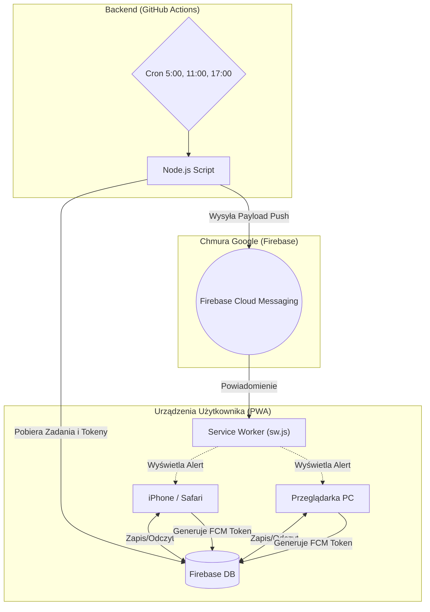

# B-Core 🧠 (Osobisty System Produktywności)

  
  
  
  
  
  
  
  
  

Witaj w centralnym repozytorium **B-Core** – mojego własnego, mocno przebudowanego systemu produktywności. Całość postawiłem na darmowej architekturze Serverless. Aplikacja hula jako PWA (Progressive Web App) prosto z GitHub Pages. Podeszłem do tematu tak, żeby nie płacić za hosting, więc dane lecą przez Firebase, a zadania i powiadomienia odpalam darmowym "backendem" zrobionym na GitHub Actions.

### W czym to napisałem? (Stos Technologiczny)
* **HTML5 / CSS3 / JavaScript (Vanilla):** Cały front-end aplikacji naklepałem z palca. Zdecydowałem się na czysty kod (olałem frameworki typu React czy Vue), bo chciałem zobaczyć, jak szybko to może śmigać na słabszych telefonach. Szczerze? Ładuje się w ułamek sekundy.
* **Firebase (Realtime DB, Auth, Cloud Messaging):** Szybka baza NoSQL, która trzyma moje całe cyfrowe życie. Oprócz logowania, ogarnia też wysyłanie powiadomień Push (FCM), co swoją drogą potrafi nieźle zirytować przy debugowaniu na iOS...
* **GitHub Actions & Node.js:** Mój "backend z odzysku". Node'owe skrypty odpalają się na maszynach GitHuba przez crona, sprawdzają co mam do zrobienia w bazie i pchają powiadomienia na telefon.
* **Python:** Lokalny kombajn. W sumie skrypt `sync.bat` wywołuje kod w Pythonie, który parsuje duże pliki XLSX, czyści z nich brudy i wypluwa zgrabnego JSON-a prosto do `local_data.js`.
* **Markdown:** Wiadomo, do renderowania notatek, żeby jakoś to wyglądało bez wciskania setki przycisków formatowania (przy okazji, tabelki w markdownie czasami mnie wykańczają).
* **Google Analytics:** Podpiąłem do kilku głównych widoków, żebym wiedział, ile czasu marnuję wgapiając się w pulpit zamiast po prostu robić te zadania.

## 👀 Rzut oka na interfejs

**Wersja Desktopowa (PC)**

  

  
  

**Wersja Mobilna (PWA / Smartfon)**

  
  &nbsp;&nbsp;&nbsp;
  

Osobiście wciąż mam ochotę wyrzucić ten ciemny pasek boczny z wersji desktopowej, bo trochę gryzie mi się z resztą "glassmorphismu", ale narazie nie mam pomysłu czym go zastąpić. Działa, to działa.

## 🏗️ Architektura Systemu

To wszystko kręci się wokół takich kawałków:
1. **Frontend (PWA):** Zwykły Vanilla JS, bez magii. Dzięki Service Workerowi śmiga offline, a na telefonie zachowuje się jak natywna apka (chociaż cache'owanie potrafi zepsuć odświeżanie zmian).
2. **Baza Danych (Firebase Realtime Database):** Autoryzacja i zrzut całego mojego stanu.
3. **Backend / Cron (GitHub Actions):** Odpalane parę razy dziennie skrypty Node.js. Czytają bazę i uderzają w API FCM, żeby wybudzić mój telefon.

### Schemat Przepływu Danych

---

## 🚀 Instalacja i Konfiguracja (Self-Hosted)
Zbudowałem to wyłącznie dla siebie (i reguły bezpieczeństwa Firebase blokują niezalogowanych), ale jeśli chcesz postawić to u siebie na własną rękę:
1. Sklonuj to repo.
2. Odpal nowy projekt w [Firebase](https://firebase.google.com/) i włącz Realtime Database + Authentication (Email/Password).
3. Wygeneruj klucze konfiguracyjne ze swojej bazy i podmień je w pliku `/app/js/firebase.js`.
4. Wygeneruj klucze VAPID (do notyfikacji Push) i wrzuć je do `notifications.js`.
5. Dodaj sekrety z Firebase (Service Account Key) w ustawieniach repo na GitHubie, żeby Actions mogły się autoryzować.

---

## 📁 Struktura Katalogów i Plików

Całe jądro aplikacji siedzi w folderze `/app`. Z root-a masz tylko redirect z `index.html`.

### 📂 /.github
Katalog na rzeczy devopsowe.
* `workflows/notify.yml` – Zwykły plik yml, który każe GitHubowi odpalać skrypt cronem.
* `scripts/check-and-notify.js` – Skrypt w Node.js z paczką `firebase-admin`. Wyciąga z bazy tokeny telefonów i wysyła im payload powiadomień. 

### 📂 /.private
Tu trzymam rzeczy lokalne, których nie wysyłam do GitHuba w pełnej formie (wiadomo, pliki z osobistymi rzeczami).
* `sync.bat` – Skrypt pod system Windows. Ten skrypt ciągle się psuje przy zmianie ścieżek na moim kompie, nie mam jeszcze na to dobrego rozwiązania, więc edytuję go palcem co jakiś czas. Odpala Pythona i eksportuje jsony z Exceli.

### 📂 /app
Tutaj leży kod frontendu.
* `manifest.json` – Plik konfiguracyjny dla PWA (kolorki, ikony, nazwa). 
* `sw.js` – Service Worker przechwytujący push. Nienawidzę debugować tego pliku (działa tylko na https!).
* **Widoki HTML:**
  * `login.html` – Autoryzacja.
  * `index.html` – Złożony pulpit główny naszpikowany widgetami.
  * `inbox.html` – Tu wrzucam wszystko na szybko do rozdzielenia.
  * `budget.html` – Kasa, wydatki i subkonta.
  * `knowledge.html`

### 📂 /app/css
* `styles.css` – Jeden, chamsko wielki plik ze stylami CSS. Zamiast dzielić na setki plików, ładuję tu zmienne pod Dark Mode i układ flexboxa.

### 📂 /app/js (Logika Aplikacji)
Żeby to jakoś ogarnąć, porozbijałem skrypty na mniejsze moduły (ES6).

#### ⚙️ Konfiguracja i Narzędzia
* `firebase.js` – Punkt wejścia do bazy. Eksportuje instancje `db` i `auth`, na których wiesza się reszta. Sprawdza też, czy masz odpowiedniego maila do logowania.
* `global.js` – Wczytywany zawsze i wszędzie, inicjalizuje statystyki w nagłówkach.
* `local_data.js` – Zrzut jsonów wygenerowanych przez ten felerny `sync.bat`. Wystarczy zwykły plik .js ze zmiennymi do natychmiastowego odczytu, bez robienia głupich requestów API.
* `utils.js` – Zbiór dupereli (formatowanie dat, escapeHTML).
* `data.js`

#### 🔔 Powiadomienia i Ustawienia
* `notifications.js` – Frontend powiadomień Push (FCM). Pobiera klucz dla danego urządzenia.
* `settings.js` – Pływający modal na ustawienia użytkownika (klucz VAPID, czas przypomnień). 

#### 🖥️ Pulpit Główny (`index.html`)
* `main.js`
* `dashboard.js` – Agreguje wyniki dla kafelków.
* `calendar.js` – Najbardziej upierdliwy kod w całym projekcie - ręcznie rysuje oś czasu 7 dni w tygodniu i mapuje bloki z zadaniami z Firebase'a na odpowiednie kratki z pikselami.
* `charts.js` – Ładuje bibliotekę Chart.js do malowania poziomu energii.
* `routines.js` – Odhaczanie porannych i wieczornych rutyn.
* `timers.js` – Sterowanie Pomodoro z blokowaniem ekranu (Tryb Skupienia).

#### 📥 Zrzutnia (`inbox.html`)
* `inbox.js`
* `tasks.js` – CRUD dla zadań.
* `ideas.js` – Dodatkowy tab na takie kompletnie luźne myśli, z których sam nie wiem co ulepić.

#### 💰 Finanse (`budget.html`)
* `budget.js` – Oblicza proste sumy dla kategorii wydatków. Nic nadzwyczajnego, podstawa matematyki.

#### 🧠 Baza Wiedzy (`knowledge.html`)
* `knowledge.js` – Interaktywne "Drzewo Wiedzy" zbudowane na wzór skilli z gier RPG.
* `knowledge-modal.js` – Zwykły pop-up wyświetlający notatki po kliknięciu.
* `srs.js` – System powtórek przestrzennych dla fiszek (Spaced Repetition System).

#### 📐 Layout i Interfejs
* `layout.js` – Chowa i pokazuje rzeczy na małych ekranach.
* `sidebar.js` – Odpowiada za lewe menu navbara i wrzucanie widgetów burz.

---

## 🔒 Zabezpieczenia i Prawa Autorskie
System skroiłem centralnie pode mnie (jedno konto w bazie). W regułach Firebase wyciąłem dostęp do ścieżki `/users/` dla wszystkich niezalogowanych adresów e-mail oprócz mojego.

---

## 🛠️ Dostosowanie i Development

Jakbyś chciał pobawić się tym kodem u siebie:
* **Motyw i kolory:** Zmienne `--accent-primary` itd. wiszą u góry `/app/css/styles.css`.
* **Dane statyczne / Nazewnictwo:** Zwykły hardkod w `index.html` oraz `sidebar.js`. Nie ma sensu tego trzymać w bazie.
* **Powiadomienia Push:** `.github/scripts/check-and-notify.js`.
* **Skrypt (`sync.bat`):** Pamiętaj, żeby zaktualizować na swoje własne ścieżki (C:\Users\...). W przeciwnym razie wywali błędem.
