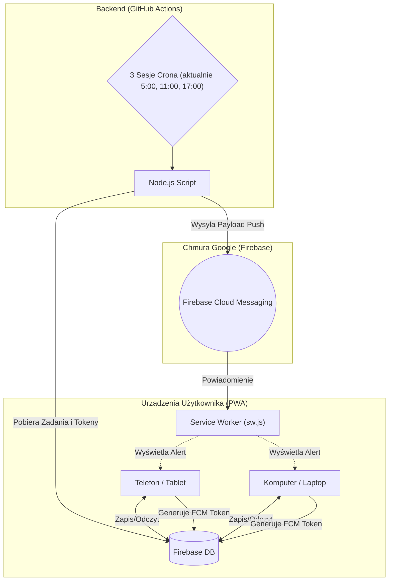

# B-Core

  
  
  
  
  
  
  
  
  

> 🌐 **Live App:** [**balubalowy.github.io/system**](https://balubalowy.github.io/system/)

Tutaj centralne repozytorium **B-Core** – własny, mocno przebudowany system produktywności. Całość jest postawiona na darmowej architekturze Serverless. Aplikacja hula jako PWA (Progressive Web App) prosto z GitHub Pages. Żeby nie płacić za hosting, to dane lecą przez Firebase Realtime Database, a zadania i powiadomienia odpalone są darmowym (i automatycznym) "backendem" zrobionym na GitHub Actions.

### Stos technologiczny (jak napisane?)
* **HTML5 / CSS3 / JavaScript (Vanilla):** Cały front-end aplikacji jest naklepany prostym i czystym kodem. Jest czysty kod (bez skomplikowanych szkieletów programistycznych (frameworków)), bo miało wszystko działać bardzo szybko, bez dużego wkładu pracy i nauki (ze względu na moją tylko podstawową wiedzę).
* **Firebase (Realtime DB, Auth, Cloud Messaging):** Szybka baza NoSQL, która magazynuje całe cyfrowe życie. Oprócz logowania, ogarnia też wypluwanie powiadomień Push (FCM). Czasem nie działało po stronie testera ze względu na Brave i domyślnie wyłączone usługi Google do powiadomień typu push.
* **GitHub Actions & Node.js:** Node'owe skrypty budzą się regularnie na maszynach GitHuba przez crona, skanują co jest zrobienia w bazie i aktywują powiadomienia na wszystkich klientach (komputer, laptop, telefon, tablet, zegarek poprzez integrację z telefonem).
* **Python:** Lokalny rzeźnik. Skrypt `sync.bat` wywołuje kod w Pythonie, który wykonuje analizę plików Excel (.XLSX), wywala z nich śmieci i pakuje czysty JSON prosto do `local_data.js`.
* **Markdown:** Renderowanie notatek, list zadań, stworzenie tego readme.
* **Google Analytics:** Wpięte do głównych widoków, żeby było wiadome ile (jak dużo) czasu jest marnowane na zwykłym bezproduktywnym patrzeniu w ekran. Brak specjalnych funkcjonalności, to plany na rozbudowę.

## Interfejs aplikacji

**Wersja Desktopowa (PC) - na dzień 21.07.2026**

  

  
  

**Wersja Mobilna (jako ProgressiveWebApp z ekranu głównego) na dzień 21.07.2026**

  
  &nbsp;&nbsp;&nbsp;
  

Osobiście ciągle są podejmowane rozkminy nad wyglądem aplikacji, szczególnie paskiem bocznym i całym motywem, aktualnie jest do dyspozycji 6 motywów przy ikonce księżyca. Do tego zmiana układu tzw. hamburgera podczas sesji mobilnej.

## Architektura Systemu

1. **Frontend (PWA):** Zwykły Vanilla JS. Dzięki Service Workerowi śmiga offline, a na telefonie zachowuje się jak natywna apka. (Choć przy szybkich aktualizacjach zapisywanie w pamięci podręcznej Cache często dodawało irytacji).
2. **Baza Danych (Firebase Realtime Database):** Centralne przechowywanie danych, dostęp zabezpieczony kilkoma metodami.
3. **Backend / Cron (GitHub Actions):** Odpalane parę razy dziennie skrypty Node.js pobierające dane z bazy. Dodatkowo scripts google, które pobierają dane z Google Calendar o wydarzeniach jakie mają dziś miejsce i w trakcie bieżącego tygodnia.

### Schemat Przepływu Danych

---

## Instalacja i Konfiguracja (Self-Hosted)
Wyłącznie dla siebie (reguły bezpieczeństwa Firebase z automatu blokują obcych). Możliwe, że w przyszłości zostanie udostępnione coś, co będzie hulać globalnie.

---

## 📁 Struktura Katalogów i Plików

Główna część aplikacji znajduje się w folderze `/app`. Poza nim jest tylko redirect z `index.html`.

### 📂 /.github
Katalog dla skryptów automatyzacji i Github Actions (dla powiadomień).
* `workflows/notify.yml`
* `scripts/check-and-notify.js`

### 📂 /.private
Lokalne brudy, pozostałości i prywtne dane, które nie są udostępniane do GitHuba ze względów oczywistych.
* `sync.bat` – prosty skrypt do synchronizacji danych statystycznych i puschowania na serwer githuba, włącza zbudowaną aplikację w .py

### 📂 /app
Tutaj leży kod frontendu.
* `manifest.json` – plik konfiguracyjny dla PWA (aby strona działała jako apka)
* `sw.js` – Service Worker obsługujący logikę powiadomień Push
######
* **Widoki HTML:**
  * `login.html` - ekran logowania (tu jest wykonywane logowanie, które od góry weryfikuje osoby, które mają mieć dostęp do danych wrażliwych - kalendarz google, budżet, notatki)
  * `index.html` – pulpit główny (dashboard praktycznie ze wszystkim)
  * `inbox.html` - wrzutnia (tutaj są wrzucane zadania i pomysły)
  * `budget.html` - budżet (tutaj jest pokazana analiza budżetu)
  * `knowledge.html` - wiedza (sekcje nauki wraz z progresem, materiałami - na razie wersja poglądowa, w przyszłości będą tu w pełni działające kursy, pokazujące indywidualny progres nauki)

### 📂 /app/css
* `styles.css` – jeden plik ze stylami CSS (ładniee zwane Kaskadowymi Arkuszami Stylów), zawierający też zmienne pod Dark Mode i główny układ interfejsu, tutaj jest cały wygląd, bez którego wszystko wyglądałoby jak notatka w markdownie/wordzie

### 📂 /app/js 
Dla jasnego (logicznego) utrzymania wszystko jest pocięte na moduły ES6. Nie byłoby czytelne to gdybym miał kilka tysięcy linjek w jednym pliku, a tak pliki mieszczą się w zakresie 100-600 linijek. 

####  Konfiguracja i Narzędzia
* `firebase.js` – punkt wejścia do bazy, sprawdza też, czy loguje się uprawnionym mailem
* `global.js` – inicjalizacja statystyk w nagłówkach
* `local_data.js` – statyczny obiekt wygenerowany automatycznie przez plik batch
* `utils.js` – formatowanie dat, escapeHTML
* `data.js` - lista rutyn i drzewko skilli (szablony)

####  Powiadomienia i Ustawienia
* `notifications.js` - system powiadomień
* `settings.js` - ustawienia systemu (aktualnie tylko pod system powiadomień, w przyszłości więcej funkcji)

####  Pulpit Główny (`index.html`)
* `main.js` - zaciąga z poniższych plików
* `dashboard.js`- odpowiedzialny za zadania
* `calendar.js` – rozbudowana część do wywołania kalendarza, także jest odporny na zmiany stref czasowych
* `charts.js` -  sekcja z postępami w nauce i wykresem energii
* `routines.js` - rutyny (szablon)
* `timers.js` - sekcja z Timerami do odliczenia po rozpoczęciu sekcji skupienia (aktualnie nie działa)

####  Zrzutnia (`inbox.html`)
* `inbox.js` - wszystko tutaj w formie CRUD (Create, Read, Update, Delete) - zrzutnia
* `tasks.js` – CRUD od zadań
* `ideas.js` - CRUD od pomysłów

####  Finanse (`budget.html`)
* `budget.js` – działanie arkusza z budżetem, wydatkami i wpływami (także przyszłymi), umożliwia także powtarzalne wpływy/wydatki

####  Baza Wiedzy (`knowledge.html`)
* `knowledge.js` – zwizualizowane sekcje wiedzy 
* `knowledge-modal.js` - ciąg dalszy sekcji wiedzy
* `srs.js` – system SRS (Space Repetition System) do powtórek (fiszki)

####  Layout i Interfejs
* `layout.js` – odpowiada za dopasowywanie się sekcji do wielkości ekranu
* `sidebar.js` – odpowiedzialny za boczny pasek (jego ukrywanie się i pokazywanie)

---

## 🔒 Zabezpieczenia i Prawa Autorskie
System jest skrojony centralnie pode mnie. W regułach Firebase ordynarnie jest odcięty dostęp do ścieżki `/users/` dla jakichkolwiek maili oprócz mojego.

---

## 🛠️ Dostosowanie i Development

Możliwość wprowadzenia szybkich lokalnych zmian:
* **Motyw i kolory:** Zmienne `--accent-primary` itd. wiszą u góry `/app/css/styles.css`.
* **Dane statyczne / Nazewnictwo:** Zwykły hardkod w `index.html` oraz `sidebar.js`. Proste w edycji.
* **Powiadomienia Push:** `.github/scripts/check-and-notify.js`.
* **Skrypt (`sync.bat`):** Aktualizacja skryptów (dostęp na ten moment zablokowany).

---

## Roadmap & Historia Projektu

### Faza 0: Pomysł
* Złożoność programów takich jak Notion, brak miejsca na trzymanie wszystkiego w jednym miejscu.
* Prosty Dashboard z zadaniami i timerami odliczającymi czas na wykonanie.
* Wprowadzenie kalendarza Google.
* System fiszek do SRS.

### Faza 1: Fundamenty PWA
* Architektura Vanilla JS.
* Integracja z Firebase (DB + Auth).
* Widoki: Pulpit, Wrzutnia, Budżet, Wiedza.
* Powiadomienia Push (GitHub Actions).

### Faza 2: Iteracje i poprawki
* Wprowadzenie wielu motywów.
* Nowe kolory dla nawyków.
* Debugowanie Push na iOS.
* Modularyzacja plików JS.
* Fix ładowania Bazy Wiedzy.
* Wdrożenie nowego logo.

### 🔮 Co dalej? (Wielkie Plany)
- [ ] Optymalizacja SEO i raporty wydajnościowe (Lighthouse z F12).
- [ ] Zaawansowane wykorzystanie Google Analytics oraz Google Scripts.
- [ ] Wydzielenie PWA do w pełni osobnej, natywnej aplikacji.
- [ ] Przebudowa bazy danych, by wpuścić więcej kont niż tylko własne.
- [ ] Potężny refaktor: przepisanie całego frontendu na "coś fajnego" (np. React/Vue).
- [ ] Dalsze szlify: stabilny `sync.bat` i przepisanie kalendarza na grid.
- [ ] Na ten moment nie mam planów by jakkolwiek próbować komercjalizować ten projekt, osobiście nie czułbym się godnie, by móc czerpać korzyści z projektu, gdzie byłem w stanie wykorzystać sporo sztucznej inteligencji (ale do nauki i przyszłego zwiększania zarobków jak najbardziej - logiczny kierunek).

