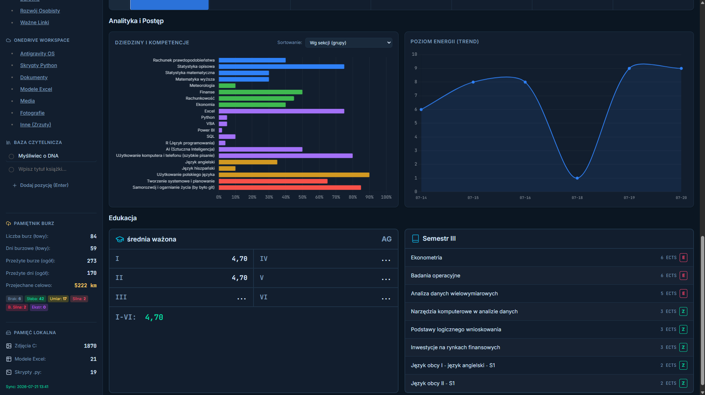
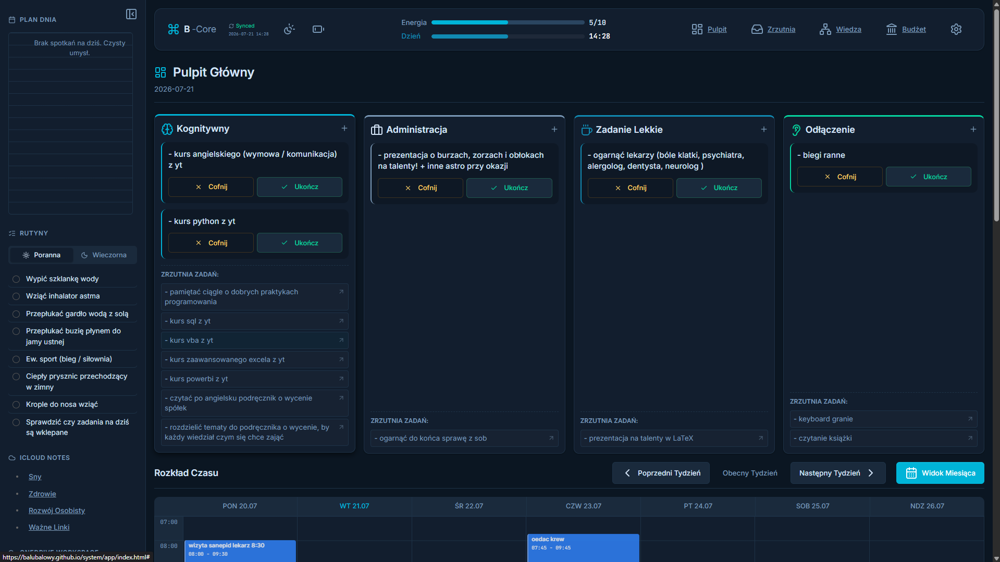
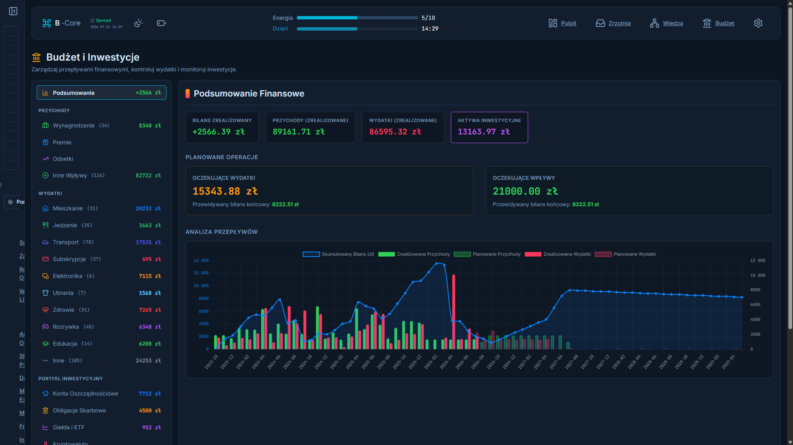
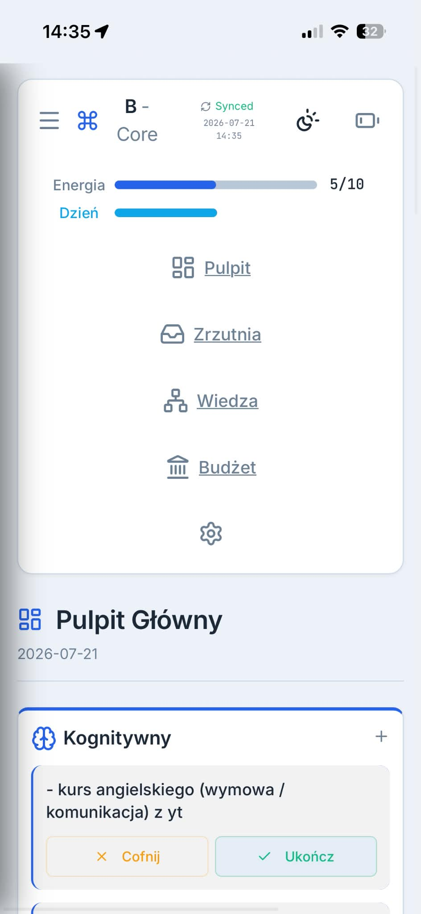
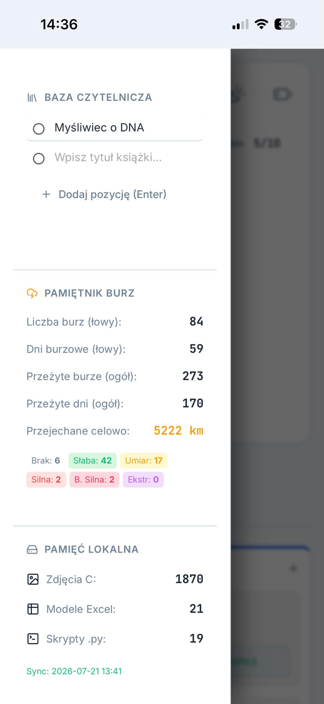
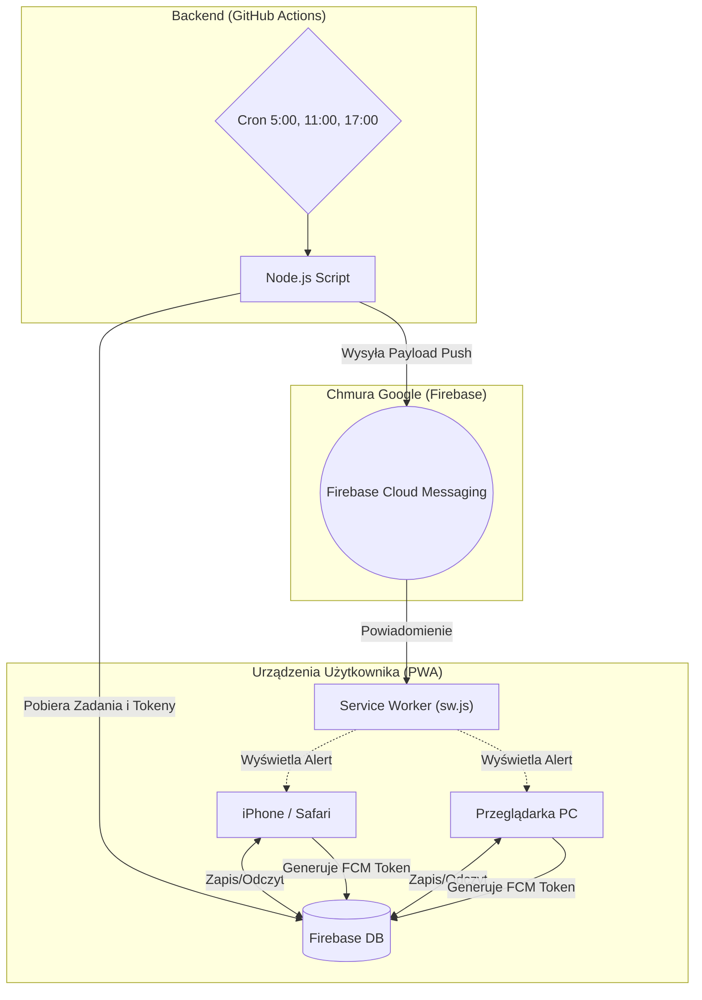

# B-Core 🧠 (Osobisty System Produktywności)

  
  
  
  
  
  
  
  
  

Witaj w centralnym repozytorium **B-Core** – zaawansowanego, osobistego systemu produktywności stworzonego na architekturze Serverless. System działa jako aplikacja PWA (Progressive Web App) w 100% hostowana na GitHub Pages, komunikująca się z bazą danych Firebase oraz wykorzystująca GitHub Actions jako darmowy "backend" do automatyzacji zadań i powiadomień.

## 👀 Rzut oka na interfejs

**Wersja Desktopowa (PC)**

  

  
  

**Wersja Mobilna (PWA / Smartfon)**

  
  &nbsp;&nbsp;&nbsp;
  

## 🏗️ Architektura Systemu

System składa się z trzech głównych filarów:
1. **Frontend (PWA):** Oparty na klasycznym stacku Vanilla JS, HTML i CSS. Szybki, lekki, działający offline, instalowalny na komputerach (Windows/Mac) i telefonach (iOS/Android).
2. **Baza Danych (Firebase Realtime Database):** Autoryzacja i przechowywanie danych w chmurze w czasie rzeczywistym.
3. **Backend / Cron (GitHub Actions):** Odpalane cyklicznie skrypty Node.js, które sprawdzają bazę danych i wysyłają powiadomienia Push bezpośrednio na urządzenia użytkownika.

### Schemat Przepływu Danych

---

## 🚀 Instalacja i Konfiguracja (Self-Hosted)
System jest zbudowany z myślą o jednym użytkowniku, ale jeśli chcesz wdrożyć własną instancję:
1. Sklonuj repozytorium.
2. Utwórz nowy projekt w [Firebase](https://firebase.google.com/) i włącz Realtime Database oraz Authentication (Email/Password).
3. Wygeneruj klucze konfiguracyjne i podmień je w pliku `/app/js/firebase.js`.
4. Wygeneruj klucze VAPID (do powiadomień Push) i dodaj je w `notifications.js`.
5. Ustaw sekrety (Firebase Service Account Key) w ustawieniach repozytorium na GitHubie (dla GitHub Actions).

---

## 📁 Struktura Katalogów i Plików

Główna aplikacja znajduje się w folderze `/app`. Korzeń projektu (root) przekierowuje użytkownika bezpośrednio do aplikacji przez prosty plik `index.html`.

### 📂 /.github
Katalog obsługujący automatyzację backendową.
* `workflows/notify.yml` – Plik konfiguracyjny Crona uruchamiający skrypt 3 razy dziennie.
* `scripts/check-and-notify.js` – Skrypt w Node.js używający paczki `firebase-admin`. Pobiera zapisane tokeny FCM, analizuje zaległe zadania i wydatki, po czym wysyła payloady powiadomień bezpośrednio na zarejestrowane urządzenia.

### 📂 /.private
Katalog na prywatne skrypty i pliki konfiguracyjne niewysyłane do głównego systemu frontendu.
* `sync.bat` – Skrypt lokalny uruchamiany na komputerze. Odpowiada za agregację i odczyt danych lokalnych (Excel/Python) do pliku w PWA.

### 📂 /app
Główny folder z widokami aplikacji PWA.
* `manifest.json` – Manifest PWA. Odpowiada za kolorystykę, nazwę i instalowalność aplikacji na smartfonach. Posiada specjalne parametry omijające cache na GitHub Pages.
* `sw.js` – Service Worker. Serce powiadomień Push i obsługi PWA na urządzeniu. Działa w tle (nawet po zamknięciu PWA), przechwytuje alerty z FCM i wyświetla je jako natywne powiadomienia systemowe.
* **Widoki HTML:**
  * `login.html` – Ekran autoryzacji (Firebase Auth).
  * `index.html` – Główny pulpit (Dashboard) z widgetami (Nawyki, Kalendarz, Szybkie Notatki).
  * `inbox.html` – Zrzutnia Zadań. Priorytetyzacja i rozdzielanie zadań na kategorie.
  * `budget.html` – Budżet, subkonta, subskrypcje i zbliżające się wydatki.
  * `knowledge.html` – Baza Wiedzy (katalog artykułów, filmów i książek).

### 📂 /app/css
* `styles.css` – Główny i jedyny plik stylów. Wykorzystuje zmienne CSS dla ułatwienia zmian motywu (Dark Mode), responsywność w oparciu o Flexbox/Grid i nowoczesny "glassmorphism".

### 📂 /app/js (Logika Aplikacji)
Logika została precyzyjnie podzielona na mniejsze moduły (ES6), aby łatwiej było nią zarządzać i skalować kod.

#### ⚙️ Konfiguracja i Narzędzia
* `firebase.js` – Serce autoryzacji i połączenia z chmurą. Inicjuje instancję `db` oraz `auth`, z których korzystają pozostałe skrypty. Zabezpiecza stronę (Auth Guard), wyrzucając niezalogowanych.
* `global.js` – Główny skrypt ładowany na każdej stronie. Łączy globalne elementy UI (topbar, statystyki edukacji i burz) oraz inicjuje podstawowe usługi.
* `local_data.js` – Plik generowany automatycznie przez `sync.bat`. Przechowuje statystyki z komputera (zdjęcia, excel, python, pamiętnik burz, średnie I-VI), by PWA mogło je odczytać błyskawicznie bez serwera.
* `utils.js` – Zestaw uniwersalnych narzędzi (np. formatowanie dat, `escapeHTML`, generowanie UUID), zapobiegające m.in. atakom XSS.
* `data.js` – Plik przechowujący bazowe, statyczne zbiory danych (np. hierarchię dziedzin Bazy Wiedzy).

#### 🔔 Powiadomienia i Ustawienia
* `notifications.js` – Front-endowy klient powiadomień Push. Rejestruje Service Workera (`sw.js`), generuje unikalny token urządzenia FCM i paruje go z Twoją bazą Firebase.
* `settings.js` – Dynamiczny modal ustawień użytkownika (klucz VAPID, parametry czasowe). Komunikuje się z systemem operacyjnym przy żądaniu uprawnień do powiadomień Push.

#### 🖥️ Pulpit Główny (`index.html`)
* `main.js` – Punkt wejścia dla głównego pulpitu. Rejestruje kluczowe zdarzenia i bootuje komponenty.
* `dashboard.js` – Odpowiada za agregację i wyświetlanie dziennych wskaźników postępu na pulpicie.
* `calendar.js` – Renderuje autorski, 7-dniowy układ kalendarza (Oś czasu), mapując Twoje bloki operacyjne na konkretne godziny.
* `charts.js` – Wizualizacja analityki za pomocą biblioteki Chart.js. Rysuje wykres liniowy poziomu energii oraz wykres słupkowy kompetencji.
* `routines.js` – Moduł obsługujący Twoje codzienne, cykliczne rutyny (Nawyki / Dziennik) widoczne na pulpicie.
* `timers.js` – Zaawansowany moduł zarządzający pełnoekranowym Trybem Skupienia (Focus Mode) i licznikami pomodoro/flow.

#### 📥 Zrzutnia (`inbox.html`)
* `inbox.js` – Główny kontroler Zrzutni, sterujący przepływem informacji i zakładkami.
* `tasks.js` – Operacje bazodanowe na zdaniach. Pozwala dodawać, kategoryzować, odkładać w czasie i odhaczać To-Do'sy.
* `ideas.js` – Oddzielny strumień dla szybkich notówek, pomysłów (Ideas), które nie są stricte zadaniami do zrobienia.

#### 💰 Finanse (`budget.html`)
* `budget.js` – Potężny silnik finansowy. Zlicza salda na subkontach inwestycyjnych i bieżących, kalkuluje przepływy (wydatki/dochody) i informuje o nadchodzących subskrypcjach.

#### 🧠 Baza Wiedzy (`knowledge.html`)
* `knowledge.js` – Tworzy interaktywne "Drzewo Wiedzy", grupując kompetencje na dziedziny takie jak Programowanie czy Kognitywistyka.
* `knowledge-modal.js` – Obsługa modalnego okna pop-up, które wyświetla się po kliknięciu w konkretną dziedzinę (zawiera jej detale i linki).
* `srs.js` – Moduł Powtórek Przestrzennych (Spaced Repetition System). Algorytm do inteligentnego przepytywania z fiszek, podobny do Anki.

#### 📐 Layout i Interfejs
* `layout.js` – Kontroler responsywnego układu. Pilnuje ukrywania/pokazywania elementów na mniejszych ekranach (smartfonach).
* `sidebar.js` – Generuje i animuje lewy panel boczny w PWA. Tworzy przyciski nawigacyjne oraz renderuje dynamiczne podsumowania Pamiętnika Burz i Pamięci Lokalnej.

---

## 🔒 Zabezpieczenia i Prawa Autorskie
System został zaprojektowany z myślą o jednoosobowym użytku (jedno autoryzowane konto w bazie). Ze względu na to, reguły bazy danych w Firebase ukrywają całe drzewo `/users/` dla osób niezalogowanych, a logowanie przyjmuje tylko specyficzne (zakodowane w regułach) maile.

---

## 🛠️ Dostosowanie i Development

Projekt jest mocno zmodularyzowany, więc ewentualne modyfikacje są proste:
* **Motyw i kolory:** Wszystkie zmienne CSS (Dark Mode, akcenty, spacing) siedzą na samej górze pliku `/app/css/styles.css` w sekcji `:root`.
* **Dane statyczne / Nazewnictwo:** Główne kategorie, nazwy widgetów czy struktura lewego paska bocznego są definiowane bezpośrednio w plikach HTML (np. `index.html`) oraz w `sidebar.js`.
* **Powiadomienia Push:** Logika powiadomień (teksty, harmonogram) żyje w `.github/scripts/check-and-notify.js`.
* **Skrypt synchronizujący (`sync.bat`):** Plik z katalogu `.private` odpowiada za odczyt lokalnych danych (Excel/Python). Wymaga ręcznej aktualizacji ścieżek, jeśli zmienisz strukturę katalogów na swoim PC.
